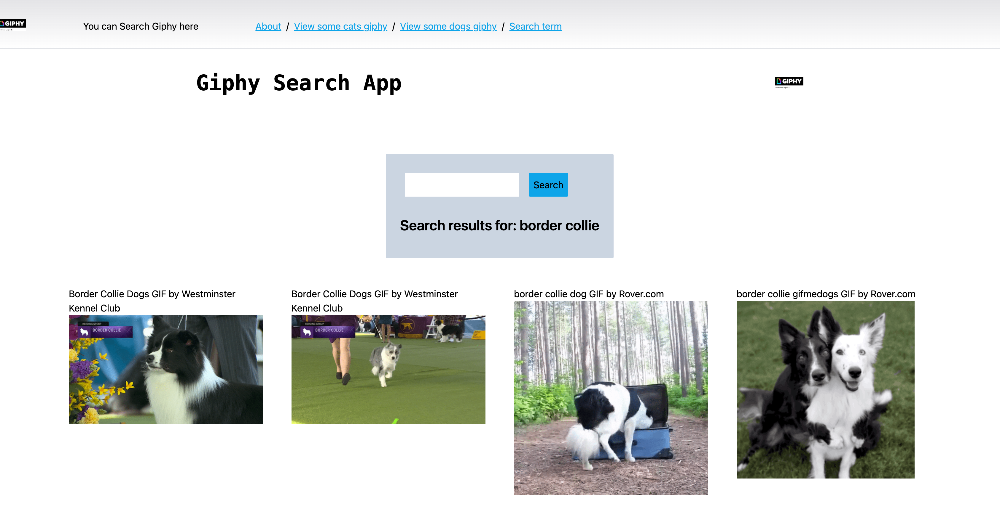

# giphy-search-app

Build a giphy search app using Next.js v12, React 18, Tailwind v3

## Deploy

Deployed by Vercel.
The project is available on link [Blog](https://giphy-search-app-bay.vercel.app/).

### UI

Here is how the design look like

## Plan for Giphy Search App

Stage I

- fetching data
- Accessing the data
- Showing the giphys to the user
- Apply styling

Stage II

- add search form
- Setting up the keyword search form
- onChange event
- Function to get the value of inputs
- Call the new function from the onChange event
- onSubmit event
- Function that runs when the form is submitted
- Call the new function from the onSubmit event
- Styling the form

Stage III:
Replace the server-side rendered page with data you fetch from your client based on a search term our user will supply.

- Storing pre-rendered data in state
- Initialize searchResults state
- Store initial dog giphy data in state

Stage IV:
Dynamic routes
domain.com/search/cats
domain.com/search/dogs

## How to run an app locally

- clone the project
- install dependencies
- run a command `npm run dev`

## Requirements

The app built using Next.js - The ultimate way to build React apps

- Next.js v13
- React 18
- useSWR
- Tailwind v3
- used giphy api

## Todo

- add unit tests
- keep data in local storage
